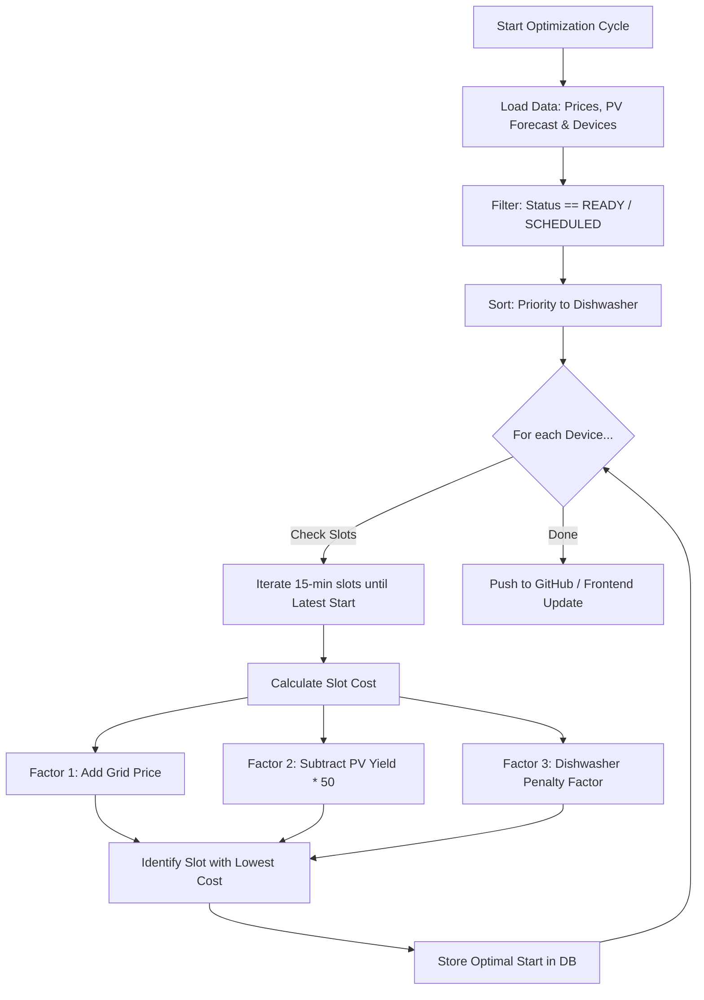

# EMS Logic Specification V1 (POC v0.6)

Dieses Dokument definiert die algorithmischen Kernregeln zur intelligenten Taktung und optimalen Energieverteilung im SunShift System.

## 1. Primäre Optimierungsziele
1. **CO2-Reduzierung (Ökologischer Impact)**: Minimaler CO2-Footprint beim Betrieb sämtlicher Verbraucher.
2. **PV-Eigenverbrauch**: Selbst erzeugter Solarstrom hat uneingeschränkte Priorität vor extern bezogenem Netzstrom.
3. **Negative Strompreise**: Werden als 100% regenerativer Überschussstrom aus dem öffentlichen Netz interpretiert (Green Grid).

## 2. Geräte-Priorisierung & Constraints
* **Dishwasher (Spülmaschine)**: Muss als allererstes Gerät fertiggestellt werden (höchste zeitliche Priorität).
* **Persistenz des Flexibilitäts-Zeitraums**: Der vom Kunden definierte Rahmen (`earliestStartTime` bis `latestEndTime`) ist absolut bindend. Er wird durch lokale EMS-Kalkulationen weder verschoben noch verkürzt und bleibt persistent erhalten.
* **Dynamisches Rescheduling**: Die Einschaltzeiten dürfen bei sich ändernden Wetter- oder Preiskurven innerhalb des Flex-Fensters jederzeit flexibel neu zugewiesen werden.


## 3. Datenquellen & API Schnittstellen
Zur Lastoptimierung steht folgender Miele Cloud Endpunkt bereit:
```bash
curl -X GET "https://ems.domestic.miele-iot.com/v1/features/powerTimeSlot?deviceId=..." \
     -H "Authorization: Bearer <token>"
```
* **Nutzen**: Liefert präzise Energy Forecasts (geplante Stromaufnahmekurven) der Geräte für eine granularere Lastverteilung.

## 4. Architektur-Entscheidungen (Q&A)
* **CO2-Erfassung**: Es wird vorerst auf externe APIs verzichtet. Der CO2-Footprint wird direkt über die Peaks des PV-Forecasts sowie negative Preise (Überschuss-Indikator) abgeleitet.
* **Deadlines**: Es gibt keine festen Endzeiten für Geräte (z.B. "Fertig bis 18:00 Uhr"). Die Logik platziert Lasten flexibel. *Erweiterung im Backlog vermerkt.*

## 5. EMS Optimierungs-Workflow
