# Miele API Connect Flow

Dieses Dokument beschreibt den Ablauf der Authentifizierung und Geräte-Erkennung (OAuth2 & Spine-IoT) zwischen dem SunShift EMS und der Miele Cloud.

## Mermaid Flowchart

```mermaid
sequenceDiagram
    participant User as Benutzer (Frontend)
    participant Backend as SunShift Backend
    participant MieleAuth as Miele Auth Server
    participant MieleAPI as Miele API (Spine-IoT)

    User->>Backend: Klick auf "Connect Account" (/api/miele/connect)
    Backend-->>User: Rückgabe der Miele Auth URL mit Scopes
    User->>MieleAuth: Weiterleitung zum Miele Login
    MieleAuth-->>User: Login-Maske & Freigabe
    User->>MieleAuth: Benutzer authentifiziert sich
    MieleAuth-->>Backend: Redirect mit Auth Code (/api/miele/callback)
    
    rect rgb(20, 30, 50)
        Note over Backend, MieleAuth: Token Exchange & Lifecycle
        Backend->>MieleAuth: POST /token (Code, Secret, ClientID)
        MieleAuth-->>Backend: Access Token (JWT) & Refresh Token
        Note over Backend: Token wird im Speicher abgelegt & verwaltet
    end

    Backend-->>User: Redirect zum Dashboard (?connected=true)
    User->>Backend: GET /api/spine/devices (mit Token)
    Backend->>MieleAPI: GET /devices (Bearer Token)
    MieleAPI-->>Backend: Liste der Geräte
    Backend-->>User: Anzeige der Geräte im UI (Kompakte Liste)
```

## Details zum Ablauf

1. **Initiierung**: Der Benutzer klickt im Frontend auf "Connect Account". Das Backend generiert die Ziel-URL für den OAuth2-Flow mit der `client_id`, dem Callback-Link und den Scopes (`openid mcs_energy_management`).
2. **Authentifizierung**: Der Benutzer wird auf die offizielle Miele-Seite geleitet. Nach erfolgreichem Login sendet Miele einen `code` an unsere Callback-URL.
3. **Token Lifecycle**: Das Backend tauscht den Code direkt gegen ein `access_token` und ein `refresh_token` ein. Ein interner Timer erneuert das Token automatisch 5 Minuten vor Ablauf.
4. **Disconnect**: Bei Klick auf "Disconnect" werden die Tokens im Backend verworfen und der Status zurückgesetzt.
