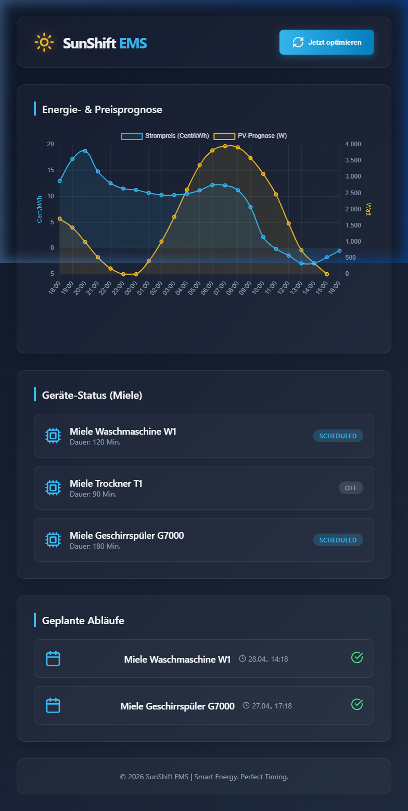

# Proof of Concept (POC) v0.1 - SunShift EMS

Dieses Dokument dokumentiert den aktuellen Stand der Entwicklung (Phase 1 MVP) nach der erfolgreichen Spezifikation und dem initialen Setup.

## 1. System-Status
* **Frontend**: Lauffähig auf Port `8091`
* **Backend**: Lauffähig auf Port `3010`
* **Datenbank**: PostgreSQL auf Port `5435`

## 2. Features in v0.1
* **Dashboard**: Visualisierung von Strompreisen (Awattar) und PV-Erträgen (Forecast.Solar).
* **Geräte-Steuerung**: Simulation von Miele-Geräten (Waschmaschine, Trockner, Geschirrspüler).
* **Optimierung**: Erste Version des Algorithmus zur Kostenminimierung ist aktiv.

## 3. Frontend Screenshot
Hier ist der visuelle Stand des Dashboards:

---
*Erstellt am 27.04.2026*
