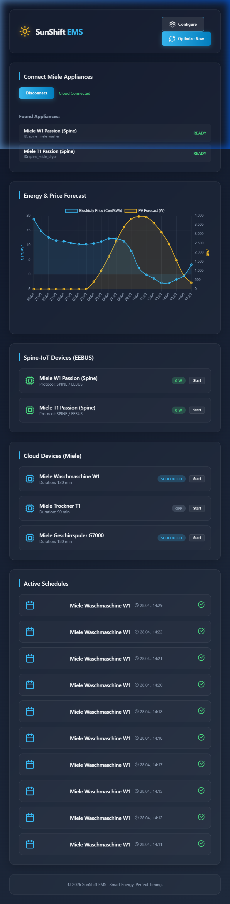

# Proof of Concept (POC) v0.2 - SunShift EMS

This document describes the status of the Proof of Concept v0.2, transitioning to an internationalized codebase and integrating advanced IoT protocols.

## 1. New Features in v0.2
* **Miele OAuth2 Integration**: Real OAuth2 handshake with the Miele domestic server, including:
  * Authorization Code Flow with PKCE/Client ID.
  * Secure handling of `access_token` and `refresh_token`.
  * Automatic background token refreshing.
* **Connect Miele Appliances UI**: A clean, specialized settings panel to initiate cloud pairing.
* **Real-time Spine Devices List**: Compact listing including model identification and `deviceId`/serial extraction.
* **Manual Overrides**: Quick start toggles via EEBUS direct command emulation.

## 2. Frontend & Experience

## 3. Infrastructure & Services
* **Frontend**: Accessible via `https://sunshift.never2sunny.eu` (Internal: Port `8091`)
* **Backend**: Node/Express layer supporting reverse-proxy token callbacks (Port `3010`)
* **Storage**: Distributed environment configuration via persistent `.env`.

## 4. Open Topics for POC 0.3
* Transition the `/api/spine/devices` endpoint from the mock logic to standard live API querying via `https://ems.domestic.miele-iot.com/v1`.
