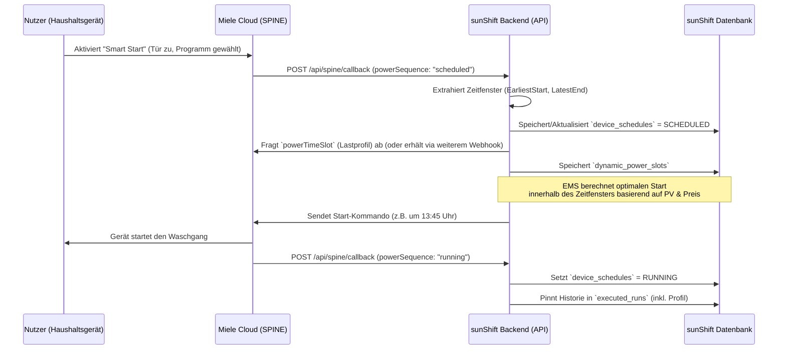

# SPINE-IoT Webhook Callback Implementation in sunShift

Das Energiemanagementsystem (EMS) von sunShift nutzt einen Push-basierten Webhook-Ansatz (Callbacks), um Zustandsänderungen von EEBUS-fähigen Haushaltsgeräten (z.B. Waschmaschinen, Spülmaschinen, Trockner) nahezu in Echtzeit zu erhalten. Dies reduziert die Last durch API-Polling (Vermeidung von Rate-Limits) und ermöglicht ein agiles Energiemanagement nach dem Use-Case `flexibleStartForWhiteGoods`.

Dieses Dokument beschreibt die Architektur, den Fluss und die Verarbeitung der eingehenden Webhooks.

---

## 1. Architektur und Anmeldung des Webhooks

Damit das Backend von sunShift Webhooks vom Miele/SPINE Cloud-Service erhält, muss sich das System für diese aktiv bei der Cloud abonnieren (Subscription).

**Registrierungsprozess (`spineService.ts`):**
Sobald das Backend eine Verbindung zur Miele-Cloud herstellt oder die Liste der verfügbaren Geräte abruft, prüft es, ob das jeweilige Gerät bereits abonniert wurde. Ist dies nicht der Fall, wird ein Subscription-Payload an die Miele API gesendet:

```json
{
  "callbackUrl": "https://sunshift.never2sunny.eu/api/spine/callback",
  "usecaseInterfaces": {
    "deviceId": "000123456789",
    "entityId": 0,
    "usecaseName": "flexibleStartForWhiteGoods",
    "usecaseMajorVersion": "v1",
    "usecaseMinorVersion": "v0"
  }
}
```

Dadurch sendet die Miele Cloud bei jeder Zustandsänderung des Use Cases (z. B. wenn der Nutzer am Gerät "Smart Start" aktiviert oder der Betrieb beginnt) einen `POST`-Request an die definierte `callbackUrl`.

---

## 2. Ablaufdiagramm (Flowchart)

Das folgende Diagramm beschreibt den Workflow, wenn ein Gerät gestartet, durch das EMS verzögert und schlussendlich ausgeführt wird.



---

## 3. Struktur der Callback-Verarbeitung

Der Endpunkt `/api/spine/callback` (`index.ts`, ca. Zeile 403) nimmt die POST-Requests der Miele-Cloud entgegen. Die Miele Cloud sendet dabei oft Arrays von Updates. 

### a) Log-Aufzeichnung
Zunächst wird der Webhook unberührt in das `ApiLog`-System geschrieben (`addApiLog`), sodass diese in der Floating Panels UI im Frontend in Echtzeit verfolgt werden können.

### b) Iteration über Payload-Elemente
Das Backend iteriert über das gesendete Array und sucht nach spezifischen Feature-Objekten (sogenannte SPINE Features). Im Fokus stehen dabei:
1. `powerSequence` (Gerätezustand und Zeitfenster)
2. `powerTimeSlot` (Detaillierter Stromverbrauch pro Zyklusabschnitt)

---

## 4. Beispiele der Payloads & Logik

### 4.1 Feature: `powerSequence` (Zeitliche Freiheitsgrade)

Das Feature `powerSequence` teilt dem EMS mit, **ob** ein Gerät bereit für Smart Start ist und **wann** es spätestens fertig sein muss.

**Beispiel Payload:**
```json
[
  {
    "change": "createReplace",
    "deviceId": "000105666767",
    "feature": {
      "featureObjType": "powerSequence",
      "deviceId": "000105666767",
      "data": {
        "sequenceId": 13,
        "state": "scheduled",
        "startTime": "2026-04-30T00:35:00Z",
        "endTime": "2026-04-30T01:53:00Z",
        "earliestStartTime": "2026-04-29T19:17:00Z",
        "latestEndTime": "2026-04-30T01:53:00Z"
      }
    }
  }
]
```

**Verarbeitungslogik im Backend:**
* Das Backend liest `state` aus (meist `SCHEDULED`, `RUNNING`, oder `INACTIVE`).
* Es speichert/aktualisiert die Datenbank-Tabelle `device_schedules`.
* Ist der Zustand `SCHEDULED` oder `RUNNING`, forciert das Backend oft ein Nachlesen (oder speichert die direkt ankommenden) `powerTimeSlots`.
* Schaltet das Gerät auf `RUNNING`, wird zusätzlich ein Eintrag in der Datenbank-Tabelle `executed_runs` erzeugt. Dies friert das prognostizierte Lastprofil zum Zeitpunkt des Starts ein, um später eine "Forecast vs. Ist"-Analyse fahren zu können.

### 4.2 Feature: `powerTimeSlot` (Lastprofil)

Das Feature `powerTimeSlot` liefert die konkrete Stromaufnahme (in Watt) für die jeweiligen Abschnitte (Slots) eines gewählten Programms. Eine Spülmaschine braucht beispielsweise zum Aufheizen extrem viel Strom (Slot 1), spült dann lange mit wenig Strom (Slot 2) und trocknet am Ende nochmal mit moderatem Strom (Slot 3).

**Beispiel Payload:**
```json
[
  {
    "change": "createReplace",
    "featureObjType": "powerTimeSlot",
    "deviceId": "000105666767",
    "data": {
      "slotNumber": 0,
      "defaultDuration": "PT15M", 
      "power": {
        "number": 2100
      }
    }
  }
]
```

**Verarbeitungslogik im Backend:**
* Das Backend extrahiert die Zeitdauer (`defaultDuration`, formatiert im ISO-8601 Duration Format, z.B. `PT15M` = 15 Minuten) und den Leistungsbedarf (`power.number` in Watt).
* Die Daten werden als einzelne Zeitblöcke ("Slots") in der Datenbank-Tabelle `dynamic_power_slots` via eines `INSERT ... ON CONFLICT DO UPDATE` gespeichert. 
* Das Frontend ruft diese Tabellen via `/api/dashboard` als aggregiertes Objekt (`powerTimeSlots`) ab und zeichnet daraus die farbigen Balken/Graphen im Gantt-Chart (Power Profile).

---

## 5. Zusammenfassung des Nutzens

Durch die Implementierung der Callbacks ist das sunShift EMS extrem skalierbar und responsiv. 
Anstelle im Minutentakt jedes angemeldete Miele-Gerät nach seinem Status zu fragen, sitzt das System passiv bereit und lauscht auf den `/api/spine/callback` Endpunkt. Erst wenn der Nutzer vor der Waschmaschine steht, sie belädt und "Smart Start" drückt, wird das Backend geweckt, holt sich die Zeitfenster/Lastprofile aus dem Webhook, speichert diese und der EMS-Scheduler übernimmt ab dann die Berechnungen.
